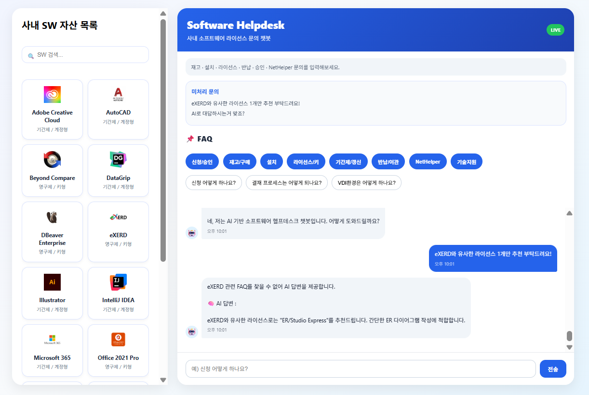

# 🤖 Software Helpdesk Chatbot Frontend

소프트웨어 설치, 라이선스, 반납 및 기술 문의를 처리하기 위한  
실시간 AI 기반 헬프데스크 챗봇 프론트엔드입니다.

React 기반 UI와 Socket.IO 실시간 통신 구조를 활용하여  
FAQ 기반 챗봇과 OpenAI API 기반 AI 응답 시스템을 직관적인 UI로 제공합니다.

---

# 🛠 기술 스택

## Frontend
- React
- JavaScript
- Axios
- Socket.IO Client

## UI
- Inline Style 기반 UI 구성
- 반응형 채팅 레이아웃
- 실시간 메시지 렌더링

---

# 🚀 주요 기능

- 실시간 챗봇 UI
- Socket.IO 기반 실시간 채팅
- FAQ 카테고리 버튼 UI
- 소프트웨어 목록 및 검색 기능
- 관리자 미처리 문의 패널
- AI 응답 생성중 로딩 UI
- 채팅 이력 복구 기능
- 자연어 기반 FAQ 질문 처리

---

# ✅ 핵심 구현 내용

## 1. 실시간 채팅 UI 구현

Socket.IO 기반 실시간 양방향 통신 구조를 적용하여:

- 사용자 질문 전송
- 챗봇 응답 실시간 출력
- 관리자 문의 패널 실시간 갱신

기능을 구현했습니다.

---

## 2. FAQ 카테고리 UI 구현

FAQ를 카테고리별 버튼 형태로 구성하여:

- 신청/승인
- 재고/구매
- 설치
- 라이선스/키
- 기간제/갱신
- 반납/이관
- NetHelper
- 기술지원

등의 문의를 빠르게 선택할 수 있도록 구현했습니다.

---

## 3. 소프트웨어 검색 기능 구현

소프트웨어 목록 및 검색 기능을 구현하여:

- IntelliJ IDEA
- PyCharm
- DBeaver
- Office
- Photoshop

등의 소프트웨어를 실시간 검색할 수 있도록 구성했습니다.

---

## 4. AI 응답 UX 개선

OpenAI API 응답 대기 중:

```text
🧠 AI 답변 생성중...
```

메시지를 출력하여 사용자 대기 경험을 개선했습니다.

---

## 5. 채팅 이력 복구 기능 구현

페이지 새로고침 시:

```text
GET /messages
```

API를 호출하여 기존 채팅 이력을 복구하도록 구현했습니다.

---

## 6. React 줄바꿈 렌더링 처리

AI 응답 내 `\n` 줄바꿈이 정상 출력되지 않는 문제를 해결하기 위해:

```jsx
style={{ whiteSpace: 'pre-line' }}
```

스타일을 적용했습니다.

---

# 📡 연동 API

## GET /messages

저장된 채팅 이력 조회

---

## GET /chat/faqs

FAQ 목록 조회

---

# 🔌 Socket Event

## Client → Server

```text
chat message
```

사용자 메시지 전송

---

## Server → Client

```text
chat response
```

챗봇 응답 수신

```text
admin-request
```

미처리 문의 관리자 패널 반영

---

# 📂 프로젝트 구조

```text
chatbot-frontend
 ├── src
 │   ├── assets       # 소프트웨어 로고 이미지
 │   ├── App.js       # 메인 채팅 UI
 │   ├── index.js     # React 엔트리 포인트
 │   └── styles       # UI 스타일 관리
 ├── public
 └── package.json
```

---

# ⚠️ 트러블슈팅

## React 줄바꿈 렌더링 문제

### 문제 상황
AI 응답 내 `\n` 줄바꿈 미적용.

### 해결 방안

```jsx
<div style={{ whiteSpace: 'pre-line' }}>
  {chat.text}
</div>
```

적용.

### 결과
AI 응답 가독성 및 채팅 UX 개선.

---

## Socket 중복 이벤트 문제

### 문제 상황
페이지 재렌더링 시 Socket 이벤트 중복 등록 발생.

### 해결 방안

```javascript
socket.off("chat response");
socket.off("admin-request");
```

cleanup 처리 적용.

### 결과
중복 메시지 출력 문제 해결.

---

# ▶ 실행 방법

## 1. 패키지 설치

```bash
npm install
```

---

## 2. React 실행

```bash
npm start
```

---

# 🎯 프로젝트 목표

- FAQ 기반 헬프데스크 UI 구현
- 실시간 문의 처리 시스템 구축
- AI 기반 자연어 응답 UX 개선
- 관리자 문의 대응 프로세스 시각화
- 직관적인 소프트웨어 문의 인터페이스 제공


---


# 메인 화면

